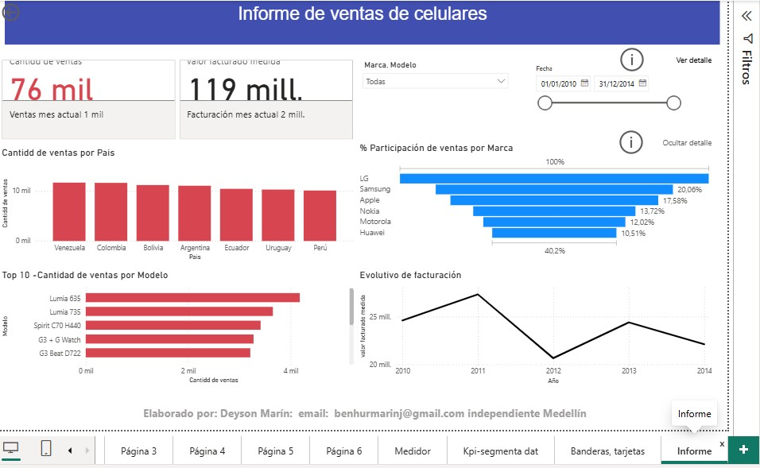

#  Proyecto Ventas de Celulares

## Descripción

Proyecto de análisis y visualización de datos de ventas de celulares desarrollado en Power BI. El objetivo es analizar el comportamiento de las ventas, identificar tendencias y obtener información relevante para apoyar la toma de decisiones.

##  Objetivo

Analizar los datos de ventas de celulares mediante indicadores, visualizaciones y segmentaciones que permitan identificar el comportamiento de las ventas y los principales resultados del negocio.

##  Tecnologías utilizadas

* Power BI
* Power Query
* DAX

##  Dashboard



##  Visualizaciones

El dashboard incluye diferentes visualizaciones para analizar el comportamiento de las ventas, entre ellas:

* Cantidad de ventas por marca.
* Comparación de ventas mediante gráficos de barras.
* Análisis mediante gráficos de columnas.
* Tendencias mediante gráficos de líneas y áreas.
* Tarjetas con indicadores principales.
* Medidores de indicadores.
* Segmentación de datos.
* Matrices para el análisis detallado.

## 🔎 Análisis

El proyecto permite explorar los datos mediante diferentes filtros y visualizaciones, facilitando la identificación de tendencias, diferencias entre marcas y comportamiento de las ventas.

##  Estructura del proyecto

```text
Proyecto-Ventas-PowerBI/
│
├── Images/
│   ├── Informe.jpg
│   ├── Cantidad_Ventas_X_Marca.jpg
│   ├── Grafico_barras_apiladas.jpg
│   ├── Grafico_Columnas_Cintas.jpg
│   ├── Grafico_lineas_areas.jpg
│   ├── Inf.TBL_Matriz.jpg
│   ├── KPI_segmentacion_datos.jpg
│   ├── Medidor.jpg
│   └── Tarjetas.jpg
│
├── PowerBi/
│   └── Visualizaciones.pbix
│
└── README.md
```

##  Conclusiones

El análisis permite obtener una visión general del comportamiento de las ventas y facilita la interpretación de los principales indicadores mediante herramientas de visualización de datos.

---

**Proyecto desarrollado con Power BI.**
